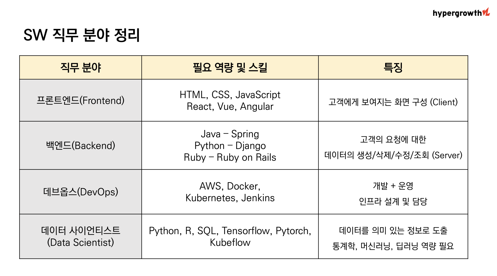

## 하이퍼그로스 소개

[하이퍼그로스란?](https://www.hypergrowth.team/) :
싸피 / 실전형 코딩교육 / 취업률 84%

## 최근 IT 동향

- 4차 산업혁명의 시대? 이미 오래된 말
- [오픈AI](https://openai.com/api/)
  , aws, 네이버 등... 기업은 보유한 모든 기술을 공개하고 있다.
- 기술에 재한 이해만 있으면 누구든 활용 가능한 시대
- 요즘은 회사에 들어가지 않아도 기술을 배우고 활용할 수 있다
- 회사가 경력직을 선효하는 이유는?
  - 역량 추정이 가능하기 때문
- 역량 중심의 수시채용 시대가 도래한 것

## 시장의 변화 & 채용 트렌드 변화

```
시장 & 채용 트렌드 분석
+ 새로운 준비 방법
+ 직군/직무 분석
```

```
1. 서류 전형

2. 온라인 코딩테스트

3. 면접(인터뷰)
    • 기술면접
    • 인성면접

4. 입사
```

---

## 먼저 확인할 것!

```
(공고) - (내가 가진 것) = 내가 없는 것 (=내가 학습해야 할 것)
```

```
직장 < 커리어 < 삶

"무엇이 되고 싶은가?"
"왜 되고 싶나?"
"어떻게 되어야 하나?"
```

### 대기업과 은행권

```
여전히 서류가 먼저 필요하다

프로젝트/코딩테스트 < 학력/서류
```

### IT 스타트업

```
학력/서류 < 프로젝트/코딩테스트
```

> 다양한 정보를 접할 수 있는 환경으로 가자!

## Mind set

    직장 < 커리어 < 삶

    🙅🏻‍♀️ 나는 토스 개발자가 되고싶다

    🙆🏻‍♀️ 나는 토스 개발자다

    🤷🏻‍♀️ 토스 개발자는 어떻게 일하지?

    > 기업 공식 사이트 혹은 해당 기업의 유튜브 채널에서 개발자들의 근무환경과 업무방식을 확인 할 수 있다.

👉 [인프런](https://www.youtube.com/watch?v=PhexX_ab_z0&list=PLpkj8RKr48wZMPKR292FOoahqxVDi6d6R),
[토스](https://toss.im/slash-21),
[라인](https://www.youtube.com/@linedevlog),
[Pycon](https://www.youtube.com/@PyConKRtube)

## Reference

### MOOC의 사례

1. [Coursera](https://www.coursera.org/)
2. [Edx - CS50](https://www.edx.org/)
3. [Udacity](https://www.udacity.com/)
4. [K-MOOC](http://www.kmooc.kr/)

### 코딩 플랫폼의 사례

1. [Codecademy](https://www.codecademy.com/)
2. [Code Avengers](https://www.codeavengers.com/)
3. [Team Treehouse](https://teamtreehouse.com/)

### 프로젝트

1. [Kaggle](https://www.kaggle.com/)
2. 다양한 공모전 및 contest
3. 내 주변 문제를 해결 > 거창할 필요 없다.
   - [싸피비전공자사례 - 깃헙](https://github.com/ejolie/sookjae)
   - [조기축구에서 유럽리그 분석](https://www.youtube.com/watch?v=dIFYZN-Ugvw)

---

### 지금은?

    4차 산업혁명 시대 (직무 역량 중심 채용의 시대)
    회사에 들어가지 않아도 기술을 학습할 수 있는 시대
    공채가 저물고 직무 역량으로 검증하는 수시 채용 시대
     👉 기업이 원하는 직무 역량을 프로젝트를 통해 쌓아갈 수 있다!

### 따라서!

```
내가 이미 그 회사의 직원이라는 마음가짐으로,
그 사람들이 어떻게 일하는지 찾아보고
MOOC을 통해 공고에는 있지만 나에게는 없는 지식을 배우자.
```

### 그리고...

```
거창할 필요없이, 주변의 문제를 해결하는 프로젝트를 하자.
반드시 학습 내용과 프로젝트는 Github에 기록하자.
그것이 포트폴리오가 되고 내 직무 역량이 된다 !!!
```

### 자소서 작성시 피해야 할 키워드!

- 성장하는 개발자 \_ 무엇을 하며 성장했는지 과정을 설명하자
- 소통하는 개발자 \_ 어떻게 소통?
- 문제를 인식하는 개발자 \_ 어떤 문제를 어떻게 해결했나?
- 사용자 편의성을을 생각하는 개발자 \_ 최근에 본 UI/UX 중에서 인상적이었던 것은 무엇인가?

> ⛔️ '저는 비전공자이지만...' 금지

# 무적권 취업 되는 3가지 공식

```
1. Github TIL을 1.5년 이상 지속
2. (나의 언어로) 타인에게 설명할 수 있는 SW 역량
3. 유저가 실사용 하는 프로젝트를 개발 & 유지보수

  마지막으로, 이 모든 것을 꾸준히 실천한다.
```

> 뭐가 됐든 아무거나 일단 하고 있어라! [스티브잡스 연설](https://www.youtube.com/watch?v=J2m-fv_wAsY)

## QnA

```
대기업&은행권 희망자?
안정적으로 돈을 벌고 싶어요, 지금부터 벌어야해요.

👉 직장 < 커리어 < 삶
```

```
관심있는 회사가 경력1년이상을 요구하는데 이런경우엔 실력만 된다면 지원해도 상관없을까요..?!
개발쪽은 꼭 경력조건이 맞아야하는건가요...?!?
👉 회사마다 상황에 따라 다름 / 보통은 거의 함께 일할 가능성이 없는 다른 팀 시니어 / 꼭 그런건 아니다
```

```
전공에 따라 급여가 달라진다면 그 회사는 나오면 된다.
취업을 소개팅으로 생각하라!
내가 끌고가는 것이지 회사에 끌려다니지 말자
```

```
CS 공부
- 단기전 : 정처기(해당 내용을 훑어나간다)
  👉 확장(면접질문 중심으로)
- 장기전 : 영어가 괜찮으시면 해외 강의 하나씩 추천
  👉 CS50 컴공개론으로 먼저 들어보시고, 관심 분야 하나씩 태클링해보기
```

---

# 목표 기업 & 직무 탐색

## 1. Frontend \_프론트엔드

```
- HTML, CSS, JavaScript를 기본으로 사용
- 요즘은 리엑트가 필수! 추가로 Vue, Angular등의 역량이 필요한다. 3개중 1개만 잘해도 나머지는 쉽게 할 수 있다.
- 프론트엔드와 웹디자인은 다은 영역   (요즘은 프론트엔드로 통합되는 추세다.)
- 클라이언트와의 커뮤니케이션에 기본 소양이 필요햐다.
- 어느정도는 디자인에 대한 관심이 필요
- 퍼블리셔와는 다름
- 프론트엔드 직무가 많이 늘어난 이유는 개인이 보유한 서버의 성능이 전반적으로 좋아졌기 때문이다.
```

디자인과 개발영역 사이 협업을 위한 참고용 사이트 [click](https://www.xfive.co/)

기업 예시 : [마이리얼트립](https://www.myrealtrip.com/)

## 2. Backend \_백엔드

```
서비스의 뒷부분을 만드는 분야
주요 언어는 Java, Python 등
추가로 Spring, Django, Ruby 등 역량이 있으면 좋다.
필요한 프로그램을 만들고 실행시 그 결과를 프론트엔드로 돌려주는 것이 백엔드의 역할이다.
```

## 3. DevOps \_데브옵스

```
DevOps = Dev(개발) + Ops(운영)

• 배포, 스케일 인/아웃, 모니터링 등의 인프라 분야
• Docker, Kubernetes, Jenkins 등의 역량 필요
```

[개발자들에게 새해란...](https://careers.linecorp.com/ko/culture/24)

## 4. Data Scientist (데이터 사이언티스트)

```
• 쌓여 있는 데이터를 의미 있는 데이터로 도출하는 분야
• vs 데이터 엔지니어 : 데이터의 수집/가공/저장이 주 업무
• 데이터 전처리, 모델 학습, ML 파이프라인 구축 등을 담당
• Python, Tensorflow, Pytorch, Kubeflow 등의 역량 필요
```



---

## SW 직군 채용 공고 사이트

[원티드](https://www.wanted.co.kr/) : IT 서비스기업, 스타트업 위주

[로켓펀치](https://www.rocketounch.com/)

[프로그래머스](https://career.programmers.co.kr/) : 개발자 전용 구인구직 사이트/ 각종 강좌, 코딩테스트 문제 제공

[자소설닷컴](https://jasoseol.com/) : 대기업, 공기업 위주/ 채용 공고를 달력 형태로 확인 가능

[점핏](https://www.jumpit.co.kr/) : 사람인에서 개발자 직군 채용시장에 뛰어든 상황

[링크드인](https://kr.linkedin.com/) : 인맥 기반, 경력직 이직 시 주로 사용

## 지원하려는 스타트업의 회사의 성장을 분석하는 Tip

[THE VC](https://thevc.kr/) : 한국 스타트업 투자 데이터베이스

[혁신의숲](https://www.innoforest.co.kr/) : 스타트업 성장분석 플랫폼

---

## 자격요건과 우대사항 모두를 만족해야 취업 가능?

```
우대사항은 말 그대로 해당 사항이 있다면 우대를 해준다는 것, 자격요건에만 부합한다면 충분히 지원 가능

자격요건으로 1, 2년 정도의 개발 경험을 요구하더라도 신입으로 지원 가능

충분히 나의 경험과 능력이 회사와 맞다고 판단이 되면 자격요건/우대사항에 크게 신경 쓰지 않아도 된다.

드물지만, 경력 채용 공고에 신입 개발자가 지원해서 합격한 경우도 실제로 있다.
```

> 채용 공고를 통해 앞으로의 교육과정을 전략적으로 학습한다!

## 회사에서 신입에게 바라는 역량은 어느 정도?

```
회사는 자격요건에 해당하는 사항을 신입이 모두 능숙하게 다룰 것이라고 기대하지 않는다.

해당 자격요건을 마스터 하겠다는 생각으로 취업 기간을 오래 가지는 것 보다
 > 프로젝트 1개라도 해봤다면 지원을 하면서 부족한 부분을 메우는 것이 좋다.

신입에게는 기술에 대한 순수 실력보다는 태도와 꾸준함을 더 많이 본다.
 > 자격요건/우대사항에 기죽지 말고, 입사하기 위해 열심히 노력한 자신의 모습을 적극적으로 어필하자!
```
